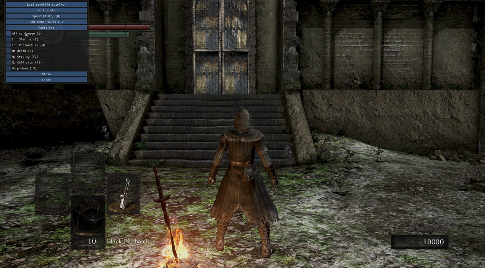
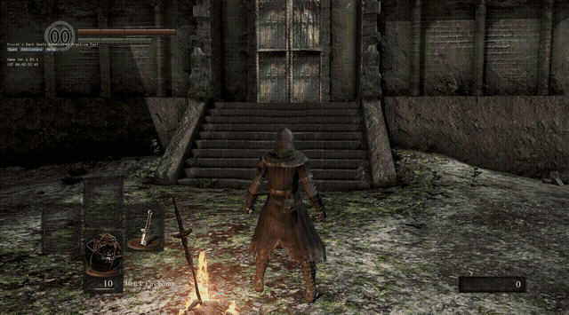

# Dark Souls Remastered Practice Tool

An in-game practice overlay for **Dark Souls: Remastered**, written from scratch in Rust.

It injects a DLL into the running game, hooks the DirectX 11 present chain, and draws an
[ImGui](https://github.com/ocornut/imgui) overlay on top of it. From there you can freeze death,
warp to saved coordinates, edit your character's stats, change game speed, and read out IGT and
position live — the things you actually need when you are grinding a route or drilling a boss.

> **Status: works, on patch 1.03.1.** Every feature in the table below has been used against a
> running game, not just compiled — including the two that call into the game's own code. The tool
> does **not** yet detect which patch it is attached to, so on any other build it will read and
> write meaningless addresses; see [Status & roadmap](#status--roadmap).



<p align="center">
  
  <br>
  <em>Opening the overlay and adding 10,000 souls — the game keeps running underneath.</em>
</p>

---

## Table of contents

- [Why this exists](#why-this-exists)
- [Features](#features)
- [Install & use](#install--use)
- [Default hotkeys](#default-hotkeys)
- [Configuration](#configuration)
- [Status & roadmap](#status--roadmap)
- [Building from source](#building-from-source)
- [How it works](#how-it-works)
- [Troubleshooting](#troubleshooting)
- [Credits](#credits)
- [License](#license)

---

## Why this exists

Speedrunners and challenge runners for the Souls games rely on practice tools to reset state
instantly instead of replaying twenty minutes of game to retry one jump. Excellent ones exist for
Dark Souls III and Elden Ring — [johndisandonato's practice tools](https://github.com/veeenu) — but
Remastered is less well served.

This project is an attempt to build one for Remastered properly: not a Cheat Engine table you have
to re-point every patch, but a compiled tool that finds its own addresses by scanning the
executable's code, ships as a single DLL, and is configured by a text file you can keep in version
control.

It is also, frankly, a project about learning: reverse engineering a shipped game binary, driving
the Windows API from Rust, writing memory access that cannot crash the host process, and generating
code from AOB (array-of-bytes) signature scans.

---

## Features

Everything in this table is implemented and works in-game.

| Feature | What it does |
| --- | --- |
| **No Death** | Survive at 0 HP. The core practice flag. |
| **All No Damage** | Take no damage at all. |
| **Quitout** | Quit to the main menu on a hotkey, without the pause screen. |
| **Deathcam** | Free the camera from the player. |
| **Event flags** | Read and flip story flags by ID — mark a boss dead, a door open, a covenant joined. |
| **Bonfire warp** | Set a bonfire ID and travel there, through the game's own travel routine. |
| **Item spawner** | Search 866 items by name, pick an infusion and upgrade level, and put them in your inventory. |
| **World debug flags** | Toggle no-dead, no-hit, no-attack, no-move, AI disable and the consumption flags for every character in the world, or for the player alone. |
| **Render flags** | Turn drawing of the map, objects, characters, SFX and cutscenes on and off. |
| **Infinite Stamina** | Stamina never drains. |
| **Infinite Consumables** | Estus, throwables, and other consumables are not spent. |
| **No Gravity** | Float — lets you get to geometry you could not otherwise reach. |
| **No Collision** | Walk through walls and terrain. Pair with No Gravity to fly. |
| **Save / load position** | Store up to 3 position + camera-angle slots and warp back to any of them instantly. |
| **Nudge position** | Move the player up or down by a fixed step, for un-sticking yourself out of floors. |
| **Character stats editor** | Live-edit level, souls, and all ten stats (vitality through humanity). |
| **Add souls** | Grant a configurable soul amount on a hotkey. |
| **Cycle game speed** | Step through a configured list of speed multipliers (0.5x / 1x / 2x / 5x …). |
| **Savefile manager** | Browse and hot-load `DRAKS0005.sl2` savefiles without leaving the game. |
| **Bonfire warp menu flag** | Force the bonfire travel menu open. |
| **Live indicators** | Game version, IGT (in-game time, to the centisecond), player position, player velocity, frame counter, and ImGui debug readouts — each toggleable at runtime. |
| **Grouped & labelled widgets** | Organise the overlay into collapsible groups from the config file. |
| **In-game log** | Widget actions print to a transient on-screen log, and to a rotating log file. |
| **Clean eject** | Unhook and unload the DLL from inside the overlay without restarting the game. |

---

## Install & use

> Windows x64 only. Dark Souls: Remastered is a Windows DX11 title and the tool is built directly
> against the Win32 API.

1. Grab the latest release archive and extract it **anywhere** — the three files just need to stay
   side by side:

   ```
   dark_souls_remastered_tool.exe          <- the injector you run
   dark_souls_remastered_tool_binaries.dll <- the overlay itself
   dark_souls_remastered_tool.toml         <- your config
   ```

2. Start Dark Souls: Remastered and load into a save. **Play offline** — see the warning below.
3. Run `dark_souls_remastered_tool.exe`. It finds `DarkSoulsRemastered.exe`, injects the DLL, and
   exits. A console window opens alongside the game for logs.
4. Alt-tab back into the game. You should see the tool's name and indicators in the top-left corner.
5. Press <kbd>0</kbd> to open the overlay, <kbd>0</kbd> again to close it, and
   <kbd>RShift</kbd>+<kbd>0</kbd> to hide it entirely.

> ### ⚠️ Play offline
>
> This tool writes to the game's memory. Using it while connected can get your account flagged or
> soft-banned, and it is straightforwardly unfair to other players. **Disconnect from the network,
> or launch the game offline, before injecting.** Use it on a save you do not mind losing — a
> mis-aimed stat write or position warp can corrupt a character.

### Uninstalling

Click **Eject** in the overlay, or close the game. The tool never writes to the game's install
directory and leaves nothing behind except its own log file next to the DLL.

---

## Default hotkeys

These come from the shipped `dark_souls_remastered_tool.toml` and are entirely yours to change.

| Key | Action |
| --- | --- |
| <kbd>0</kbd> | Open / close the overlay |
| <kbd>RShift</kbd>+<kbd>0</kbd> | Hide the overlay completely (hotkeys keep working) |
| <kbd>p</kbd> | Quitout |
| <kbd>1</kbd> | Toggle All No Damage |
| <kbd>2</kbd> | Toggle Infinite Stamina |
| <kbd>4</kbd> | Toggle Infinite Consumables |
| <kbd>5</kbd> | Toggle Deathcam |
| <kbd>6</kbd> | Toggle No Death |
| <kbd>8</kbd> | Cycle game speed |
| <kbd>9</kbd> | Add 10,000 souls |
| <kbd>F1</kbd> | Toggle AI Disable |
| <kbd>F2</kbd> | Toggle No Gravity |
| <kbd>F3</kbd> | Toggle No Collision |
| <kbd>F4</kbd> / <kbd>F5</kbd> / <kbd>F6</kbd> | Toggle rendering of characters / objects / map |
| <kbd>F9</kbd> | Open the bonfire warp menu |
| <kbd>Ctrl</kbd>+<kbd>O</kbd> | Open the savefile manager |
| <kbd>Ctrl</kbd>+<kbd>U</kbd> | Spawn the selected item |
| <kbd>RShift</kbd>+<kbd>H</kbd> / <kbd>J</kbd> / <kbd>K</kbd> | Save position into slot 1 / 2 / 3 |
| <kbd>H</kbd> / <kbd>J</kbd> / <kbd>K</kbd> | Warp to saved position 1 / 2 / 3 |
| <kbd>[</kbd> / <kbd>]</kbd> | Nudge position up / down |

---

## Configuration

`dark_souls_remastered_tool.toml` must sit **next to the DLL**. It is read once at injection time, so
edit it and re-inject to pick up changes. If it is missing or malformed the tool still loads, but
with an empty widget list — check the console and the log file for the parse error.

The file has two parts: a `commands` array that defines the overlay's widgets top to bottom, and a
`[settings]` table.

### Hotkey syntax

A hotkey is a key name, optionally prefixed with `modifier+`:

- **Keys:** `a`–`z`, `0`–`9`, `f1`–`f12`, `kp0`–`kp9`, `up`/`down`/`left`/`righ`, `space`, `enter`,
  `escape`, `tab`, `home`, `end`, `pgup`/`pgdown`, `insert`, `delete`, `backspace`, punctuation
  (`[`, `]`, `-`, `=`, `;`, `'`, `,`, `.`, `/`, `` ` ``, `\`), and mouse buttons
  (`mouseleft`, `mouseright`, `mousemiddle`, `mousex1`, `mousex2`).
- **Modifiers:** `ctrl`, `shift`, `alt`, `super` for either side, or side-specific `lctrl`/`rctrl`,
  `lshift`/`rshift`, `lalt`/`ralt`, `lsuper`/`rsuper`.

So `rshift+h`, `ctrl+o`, and `f9` are all valid. Every `hotkey` is optional — leave it off and the
widget is click-only.

### Commands

| Command | Shape | Notes |
| --- | --- | --- |
| `flag` | `{ flag = "no_death", hotkey = "6" }` | A toggleable memory bitflag. See the flag list below. |
| `position` | `{ position = "h", save = "rshift+h" }` | One save/warp slot. Repeat for more slots. |
| `nudge` | `{ nudge = 1.0, nudge_up = "[", nudge_down = "]" }` | Step size in world units. |
| `cycle_speed` | `{ cycle_speed = [0.5, 1.0, 2.0], hotkey = "8" }` | Cycles in ascending order, wrapping around. |
| `souls` | `{ souls = 10000, hotkey = "9" }` | Adds to the current total rather than replacing it. |
| `quitout` | `{ quitout = "p" }` | Quit to the main menu. Writes the game's own menu-kick field, so the save is written normally. |
| `item_spawner` | `{ item_spawner = "ctrl+u" }` | Searchable item list with infusion, upgrade level and quantity. The hotkey spawns the selected item; the button opens the panel. |
| `event_flags` | `{ event_flags = true }` | Panel to read, set and clear a story flag by its event ID. |
| `last_bonfire` | `{ last_bonfire = true }` | Panel to read and set your last bonfire, and warp to it. |
| `character_stats` | `{ character_stats = true }` | Opens the stat editor panel. Can take a hotkey instead of `true`. |
| `savefile_manager` | `{ savefile_manager = "ctrl+o" }` | Auto-discovers your save directory under `Documents\NBGI\DARK SOULS REMASTERED`. |
| `label` | `{ label = "Some heading" }` | Static text. An empty string is a spacer. |
| `group` | `{ group = "Positions", commands = [ … ] }` | Nests commands into a collapsible group. |

**Available flags:**

- *Player:* `no_death`, `inf_stamina`, `inf_consumables`, `gravity` (i.e. *no* gravity),
  `collision` (i.e. *no* collision), `player_no_dead`, `player_exterminate`, `player_hide`,
  `player_silence`.
- *Every character in the world:* `all_no_damage`, `all_no_dead`, `all_no_hit`, `all_no_attack`,
  `all_no_move`, `all_no_stamina`, `all_no_mp`, `all_no_arrow`, `all_no_magic_qty`, `ai_disable`.
- *Rendering:* `rend_map`, `rend_obj`, `rend_chr`, `rend_sfx`, `rend_cutscene`.
- *Other:* `deathcam`, `wrap_menu`.

The `all_*` and `player_*` flags and `all_no_damage` are whole-byte booleans in the game's debug
flag block, not bits in a character struct — which is why they apply world-wide and survive a
reload.

> `wrap_menu` is a typo for *warp* menu that is currently baked into the config key. It is left
> as-is so existing configs keep working; renaming it with a backwards-compatible alias is on the
> roadmap.

### Settings

```toml
[settings]
log_level = "DEBUG"     # TRACE | DEBUG | INFO | WARN | ERROR | OFF
display = "0"           # open/close the overlay
hide = "rshift+0"       # hide it entirely (optional)
show_console = true     # currently a no-op, see roadmap
indicators = [
  { indicator = "game_version", enabled = true },
  { indicator = "igt", enabled = true },
  { indicator = "position", enabled = false },
  { indicator = "position_change", enabled = false },
  { indicator = "framecount", enabled = false },
  { indicator = "imgui_debug", enabled = false },
]
```

Indicators render in the order you list them, and can be toggled at runtime from the **Indicators**
button without editing the file. Valid names: `game_version`, `igt`, `position`, `position_change`,
`framecount`, `imgui_debug`, plus `fps` and `animation`, which parse but do not yet draw anything.

`dark_souls_remastered_tool_complete.toml` in the repo root is a **target** config showing the full
intended surface, including commands that are not implemented yet. It will not load as-is.

---

## Status & roadmap

### Working

The entire [Features](#features) table, verified in-game on version **1.03.1**. That includes the
two features that call game code — bonfire warp and the item spawner — which are the ones most
likely to break on another patch.

### Partial / known warts

| Item | Detail |
| --- | --- |
| **Version detection** | `libdsr::version::get_version()` returns `V1_03_1` unconditionally instead of reading the PE version at runtime, so the tool attaches to any patch and writes to addresses that mean nothing there. The AOB scanner already handles multiple versions; only the runtime lookup is stubbed. This is the most important thing left. |
| **Event flags** | Read and write work, and the panel lists the 26 documented boss flags by name, but that is a small slice of the flags the game has. Anything else needs its numeric ID. |
| **Warp menu** | The `wrap_menu` bitflag forces the travel menu open, but the dedicated `warp_menu` widget (`tool/src/widgets/warp_menu.rs`) is not wired into the config and is not functional. |
| **`show_console`** | Parsed from the config and then never read — the console is always allocated. |
| **`fps` / `animation` indicators** | Accepted by the config parser but not rendered. |
| **`wrap_menu` naming** | Should be `warp_menu`, with the old spelling kept as a deprecated alias. |

### Not implemented yet

- **Open menu (travel / attune)** — `tool/src/widgets/open_menu.rs` calls into the game's menu
  functions directly. Currently crashes the game; the AOB signatures need revisiting.
- **Target lock info**, **one shot**, **event disable** — real gaps against the DS3 tool, each
  needing its own reverse engineering.
- **Multi-version support** — see version detection above. Deferred deliberately: no leaderboard
  rule pins a patch and the community's own tools target current retail, so this is worth
  confirming with runners before building for five builds.
- **Item and flag data from the game's own params** — the bundled lists come from DSR-Gadget's
  resources. Reading `EquipParam*` and the message files directly would be correct for any patch
  and regenerable, but it is a sub-project of its own.

Closed as not applicable: **ember** and **infinite focus** are DS3 mechanics with no Dark Souls
equivalent, and DS3's **hurtbox / debug draw** flags come from a render path Remastered does not
appear to expose.

---

## Building from source

### Prerequisites

- **Windows x64** with the MSVC toolchain (Visual Studio Build Tools, "Desktop development with
  C++").
- **Rust 1.88 or newer.** If `cargo` complains that a dependency needs a newer rustc, run
  `rustup update stable`.
- A copy of Dark Souls: Remastered, if you want to regenerate base addresses.

### Build

```sh
git clone https://github.com/fruizt/Dark_Souls_Remastered_Practice_Tool
cd Dark_Souls_Remastered_Practice_Tool
cargo build --release
```

This produces both halves of the tool in `target/release/`:

- `dark_souls_remastered_tool.exe` — the injector
- `dark_souls_remastered_tool_binaries.dll` — the overlay

Copy `dark_souls_remastered_tool.toml` next to them and you have a working install.

### Regenerating base addresses

The pointer offsets in `lib/libdsr/src/codegen/base_addresses.rs` are generated, not hand-written.
To regenerate them against your own game install:

```sh
cp .env.example .env
# edit .env so DSR_INSTALLS_DIR points at the directory *containing* your game folder
cargo xtask
```

`DSR_INSTALLS_DIR` should be a Steam library's `steamapps/common` — the scanner walks every
immediate subdirectory looking for a `DarkSoulsRemastered.exe`, so several patches sitting side by
side all get scanned in one pass. Point it at `steamapps/common`, **not** at
`steamapps/common/DARK SOULS REMASTERED`.

> **Use single quotes.** dotenv processes backslash escapes inside double quotes, so
> `DSR_INSTALLS_DIR="C:\Steam\..."` fails to parse and the variable ends up unset.
> `DSR_INSTALLS_DIR='C:\Steam\...'` is correct. `cargo xtask` warns if it had to skip a malformed
> `.env`.

`.env` is gitignored; do not commit yours.

A successful run prints one banner per executable it scanned and rewrites
`base_addresses.rs`:

```
VERSION 1.03.1: "\\?\C:\Program Files (x86)\Steam\steamapps\common\DARK SOULS REMASTERED\DarkSoulsRemastered.exe"
```

If `git diff` on the generated file comes back empty afterwards, the signatures still match your
binary exactly — that is the expected result on an unchanged game version.

---

## How it works

```
┌─────────────────────────────┐
│ dark_souls_remastered_tool  │  Injector binary. Finds the game process,
│           .exe              │  VirtualAllocEx + CreateRemoteThread →
└──────────────┬──────────────┘  LoadLibraryW, then exits.
               │ injects
               ▼
┌─────────────────────────────────────────────────────────────┐
│ DarkSoulsRemastered.exe                                     │
│                                                             │
│  ┌───────────────────────────────────────────────────────┐  │
│  │ ..._binaries.dll                                      │  │
│  │                                                       │  │
│  │  hudhook ──── hooks IDXGISwapChain::Present,          │  │
│  │               renders an ImGui overlay each frame     │  │
│  │                    │                                  │  │
│  │               tool::Tool  ── widget tree built from   │  │
│  │                    │         the .toml at load time   │  │
│  │                    ▼                                  │  │
│  │               libdsr::PointerChains                   │  │
│  │                    │  ReadProcessMemory /             │  │
│  │                    ▼  WriteProcessMemory              │  │
│  │               game state                              │  │
│  └───────────────────────────────────────────────────────┘  │
└─────────────────────────────────────────────────────────────┘
```

### The three crates

**`lib/libdsr`** — everything game-specific, and nothing UI-specific.

- `memedit.rs` — `PointerChain<T>` and `Bitflag<T>`. A pointer chain is a base address plus a list
  of offsets, resolved one hop at a time. The interesting decision here: even though the DLL runs
  *inside* the target process and could just dereference raw pointers, every hop goes through
  `ReadProcessMemory`. That turns a dangling pointer from an access violation that kills the game
  into a `None` the UI can shrug off. Practice tools read pointers that are legitimately invalid all
  the time — you have no character loaded on the main menu — so this is the difference between a tool
  that is usable and one that crashes on startup.
- `pointers.rs` — the actual pointer chains, written with the `pointer_chain!` and `bitflag!` macros.
  This is where the reverse-engineering work lives. `pointers_difference.txt` in the repo root is a
  working note comparing the No-Death flag's chain in Remastered against the known DS3 one.
- `event_flags.rs` — story flags. An eight digit flag ID (`G AAA S NNN`) decodes into a group base,
  an area 0x500 apart, a section of 128 bytes and a bit within a word; unknown group or area codes
  resolve to `None` rather than poking an arbitrary address.
- `funcs.rs` — the two places the tool calls the game instead of reading it: bonfire warp and item
  spawn. This is the only unrecoverable corner of the codebase, so it states its rules at the top
  and follows them — resolve every pointer first and refuse on `None`, and run the call on its own
  thread rather than on the render thread. The item spawn is a patched machine-code stub, because
  the routine takes eight arguments and the frame is easier to build by hand than to describe.
- `codegen/base_addresses.rs` — generated by `xtask`. One `BaseAddresses` constant per game version,
  as offsets from the module base.

**`tool`** — the overlay, and the injector.

- `main.rs` + `inject.rs` — the injector binary. Classic `CreateRemoteThread` → `LoadLibraryW`
  injection, with errors surfaced in a `MessageBox` rather than a console the user never sees.
- `lib.rs` — the DLL entry point. `DllMain` spawns a thread (you must not do real work on the
  loader lock) that installs the hudhook DX11 hooks.
- `tool.rs` — the render loop and the three-state UI machine (`MenuOpen` / `Closed` / `Hidden`), plus
  the indicator rendering.
- `config.rs` — the TOML schema. Each `CfgCommand` variant maps to one `Box<dyn Widget>`, so adding a
  feature means adding a variant, a match arm, and a widget module.
- `widgets/` — thin adapters binding `practice-tool-core`'s generic widget traits to DSR's concrete
  pointer chains, plus the few widgets drawn directly with imgui: the item spawner, event flags and
  the bonfire panel.
- `widgets/*.json` — bundled data. `item_ids.json` carries 866 items with their category, stack
  limit and upgrade type; `event_flag_ids.json` and `bonfire_ids.json` name the flags and bonfires
  the panels list. All three are generated from DSR-Gadget's resources and covered by tests, since
  a wrong ID is the kind of bug that costs a play session to notice.

**`xtask`** — the code generator, run as `cargo xtask`.

It opens each `DarkSoulsRemastered.exe` it finds with `pelite`, reads the PE version resource, and
searches the code sections for byte signatures with wildcards. Three scan strategies are supported:
a direct match, a match plus a `u32` read at an offset (for `mov rax, [rip+disp32]`), and a
double-indirect that resolves a RIP-relative displacement into an absolute address. The result is
written out as Rust source. This is why the tool does not need re-pointing by hand when a patch
shifts the binary around: the signatures describe *code*, which tends to survive recompilation, not
addresses, which do not.

---

## Troubleshooting

**"Could not find process"** — the game is not running, or it started after you clicked the
injector. Load into a save first, then inject.

**Injection fails, or nothing appears** — run the injector as Administrator. Injecting into a
process you do not have `PROCESS_ALL_ACCESS` on will fail at `OpenProcess`.

**The overlay never appears but the console shows no errors** — the tool hooks **DX11** only. Make
sure the game is not being forced through a DX12 translation layer or a competing overlay
(third-party framerate unlockers and overlays that also hook `Present` can win the race).

**Everything reads zero, or stats are nonsense** — you are almost certainly not on patch 1.03.1.
Check the Game Version indicator against what the tool expects, and see
[version detection](#partial--known-warts).

**Hotkeys do nothing while the overlay is open** — that is deliberate. Hotkeys are suppressed while
an ImGui text field has keyboard focus, so you can type numbers into the stat editor.

**Where are the logs?** — `dark_souls_remastered_tool.log`, next to the DLL. Raise `log_level` to
`"TRACE"` in the config for more detail.

**`cargo xtask` says `DSR_INSTALLS_DIR is not set` even though it is in `.env`** — your `.env` is
double-quoted. Switch to single quotes; see [Regenerating base
addresses](#regenerating-base-addresses).

**`cargo xtask` finds no version at all** — `DSR_INSTALLS_DIR` is pointing at the game folder rather
than its parent, so the scanner is looking for
`DARK SOULS REMASTERED/DARK SOULS REMASTERED/DarkSoulsRemastered.exe`.

---

## Credits

This project stands on [**johndisandonato**](https://github.com/veeenu)'s work, and would not exist
without it:

- [**practice-tool-core**](https://github.com/veeenu/practice-tool-core) — the generic widget, hotkey,
  and savefile-manager machinery this tool binds DSR's pointers to.
- [**hudhook**](https://github.com/veeenu/hudhook) — the DirectX hooking and ImGui rendering layer.
- The [**DarkSoulsIII**](https://github.com/veeenu/darksoulsiii-practice-tool) and
  [**Elden Ring**](https://github.com/veeenu/eldenring-practice-tool) practice tools, whose
  architecture this one deliberately follows — the crate split, the TOML config schema, and the
  AOB-codegen approach are all borrowed from there.

Also thanks to [imgui-rs](https://github.com/imgui-rs/imgui-rs) and
[pelite](https://github.com/CasualX/pelite), and to the Souls modding community for the
reverse-engineering groundwork on Remastered's structures.

---

## License

Licensed under the **GNU Affero General Public License v3.0**. See [LICENSE](LICENSE).

AGPL-3.0 is not an arbitrary choice: `practice-tool-core` is itself AGPL-3.0, and this project links
against it, so the same terms carry over. In short — you may use, modify, and redistribute this
freely, but derivative works must stay open under the same license.

---

## Disclaimer

This is an unofficial fan project. It is not affiliated with or endorsed by FromSoftware or Bandai
Namco. It is intended for **single-player, offline practice** only. Do not use it online. You are
responsible for what you do with it, including anything that happens to your save files.
